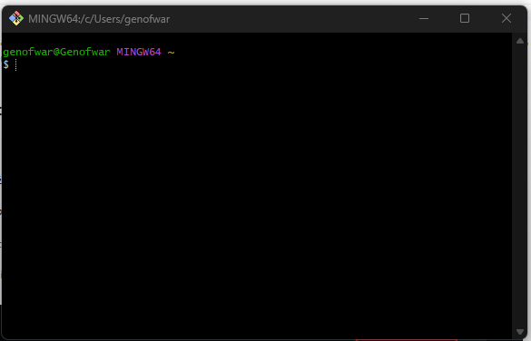
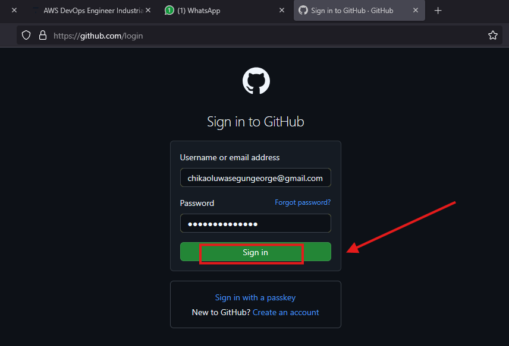
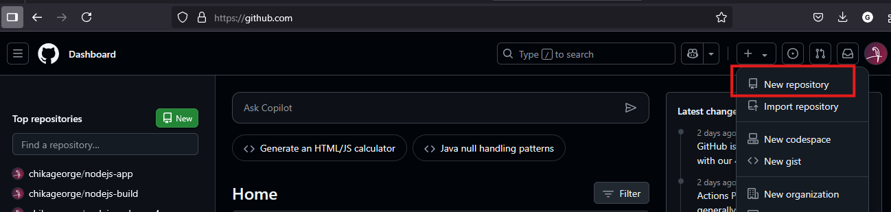
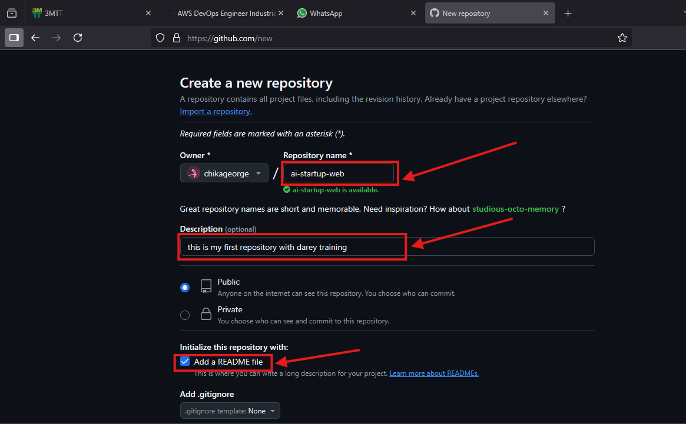
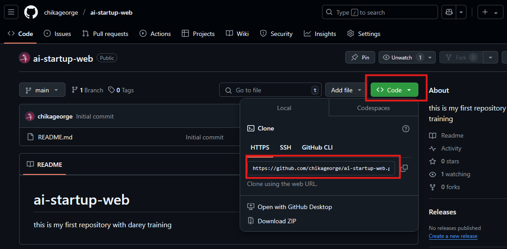
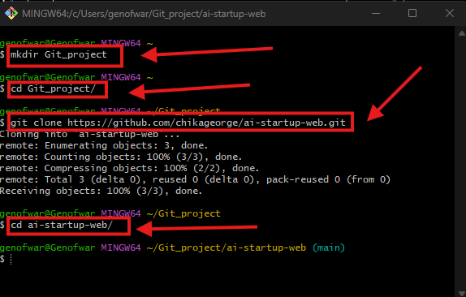
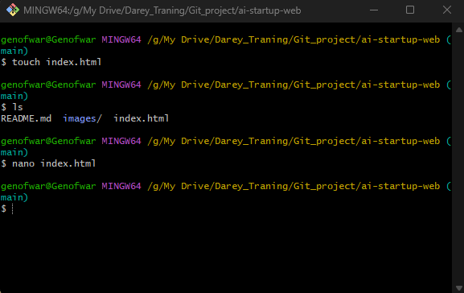
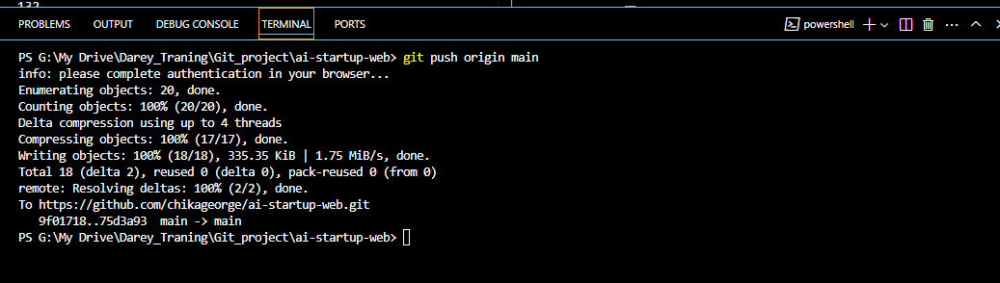
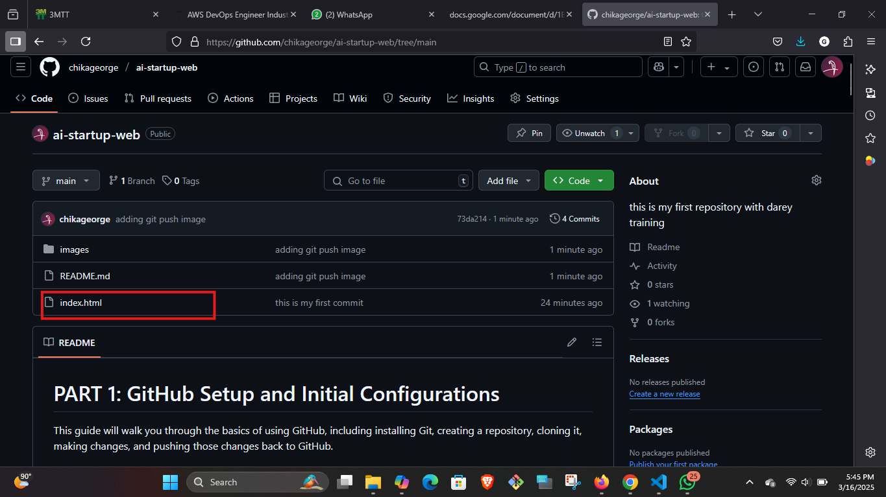

# PART 1: GitHub Setup and Initial Configurations

This guide will walk you through the basics of using GitHub, including installing Git, creating a repository, cloning it, making changes, and pushing those changes back to GitHub. 

---

## Install Git

1. **Download Git**: 
   - Visit the official Git website: [https://git-scm.com/](https://git-scm.com/).
   - Download the appropriate version for your operating system (Windows, macOS, or Linux).

   

2. **Install Git**:
   - Follow the installation instructions for your operating system.
   - Once installed, open a terminal or command prompt and verify the installation by running:
     ```bash
     git --version
     ```
   - This should display the installed version of Git.

   

---

## Login to GitHub

1. **Create a GitHub Account**:
   - If you don’t already have a GitHub account, sign up at [https://github.com/](https://github.com/).

2. **Login to GitHub**:
   - Go to [https://github.com/login](https://github.com/login) and enter your credentials to log in.

   

---

## Create a GitHub Repository

1. **Create a New Repository**:
   - On GitHub, click the "+" icon in the top-right corner and select "New repository".
   - Name the repository `ai-startup-web`.
   - Optionally, add a description.
   - Choose "Public" or "Private" visibility.
   - Check the box to "Initialize this repository with a README".
   - Click "Create repository".

   
   

---

## Clone the Repository

1. **Copy the Repository URL**:
   - On the repository page, click the "Code" button.
   - Copy the HTTPS URL (e.g., `https://github.com/your-username/ai-startup-web.git`).

   

2. **Clone the Repository Locally**:
   - Open your terminal or command prompt.
   - Create a folder named `Git_project` in your desired location:
     ```bash
     mkdir Git_project
     ```
   - Navigate into the `Git_project` folder:
     ```bash
     cd Git_project
     ```
   - Clone the repository using the copied URL:
     ```bash
     git clone https://github.com/your-username/ai-startup-web.git
     ```
   - Navigate into the cloned repository:
     ```bash
     cd ai-startup-web
     ```

   

---

## Make Changes and Commit

1. **Create a New File**:
   - Create an empty `index.html` file:
     ```bash
     touch index.html
     ```
   - Add some content to the file using a text editor or IDE.

   

2. **Check Git Status**:
   - Run the following command to see the changes that have not been staged:
     ```bash
     git status
     ```

   

3. **Stage Changes**:
   - Stage all changes for commit:
     ```bash
     git add .
     ```

4. **Commit Changes**:
   - Commit the changes with a message:
     ```bash
     git commit -m "this is my first commit"
     ```
     
---

## Push Changes to GitHub

1. **Push to GitHub**:
   - Push the changes to the `main` branch on GitHub:
     ```bash
     git push origin main
     ```

   

2. **Verify on GitHub**:
   - Go to your repository on GitHub and verify that the `index.html` file has been added.

   

---
